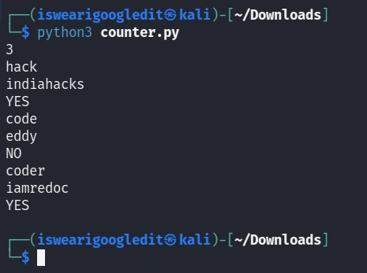

# Flentas Coding Assignment

# Screenshot

# Explanation:

We first import the Counter class from the collections module, which will help us count the frequency of characters in a string.

We define a function is_permutation_exist(pattern, text) that takes in two strings, pattern and text, and returns a boolean value indicating whether any permutation of the pattern exists in the text.

We first count the frequency of characters in the pattern using the Counter class.

We then loop through each substring of length equal to the length of the pattern in the text, and count the frequency of characters in that substring.

We check if the two frequency counts are equal, which means that the substring contains the same characters as the pattern (possibly in a different order).

If we find any such substring, we return True and print "YES" for the current test case.

If we don't find any such substring, we return False and print "NO" for the current test case.

Finally, we loop through each test case and call the is_permutation_exist function for that test case. We print "YES" or "NO" depending on the return value of the function.
